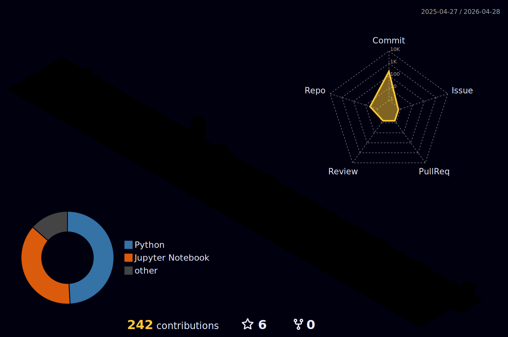

 

## Sobre mim :sunglasses:	 :

> Olá! Bem vindo ao meu `github`! Aqui eu documento todos os meus projetos e estudos que tenho realizado. Tenho direcionado os meus estudos para a área de `análise de dados` e `machine learning` utilizando a linguagem `Python`. Também realizo algumas documentações e as publico no meu <a href="https://www.linkedin.com/in/matheusalmeidacantarutti/?originalSubdomain=br"> Linkedin </a>. Me encantei pela área de tecnologia e poder trazer insights com dados é o que me motivou a mergulhar nesta imensidão de oportunidades! Quero trazer valor para a área de dados aplicando-a na área da saúde!

 
  
## Tools:

 
  
  
  
  

  
   
  
## Redes Sociais:
  

 
  
  
  
  

  

 
  

   
<b>Visitors Count</b>
  
    

 
   

