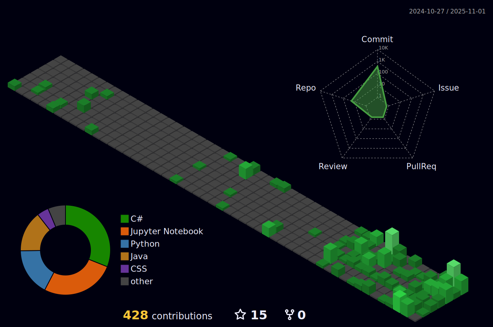

 

## About me :sunglasses:	 :

> Hello! Welcome to my GitHub! Here I document all the projects and studies I have been working on. After focusing my studies on data analysis and machine learning using the Python language, I am now also familiar with Java, with a special passion for the <strong>backend</strong>). My main goal is build systems that can be associated with Machine Learning algorithms, bringing value to all marketplaces. To follow my professional career, you can visit my <a href="https://www.linkedin.com/in/matheusalmeidacantarutti/?originalSubdomain=br">LinkedIn</a>, my YouTube channel, or even my blog on Medium. I became fascinated with the tech field! Being able to turn ideas into products truly excites me. I want to bring value to your business even to your company!

 
  
## Tools 🔥:

 
  
  
  
     
  
  

  
  
  

 

  
## Social Media:
  

 
  
  
  
  
  
  

  

 
  

